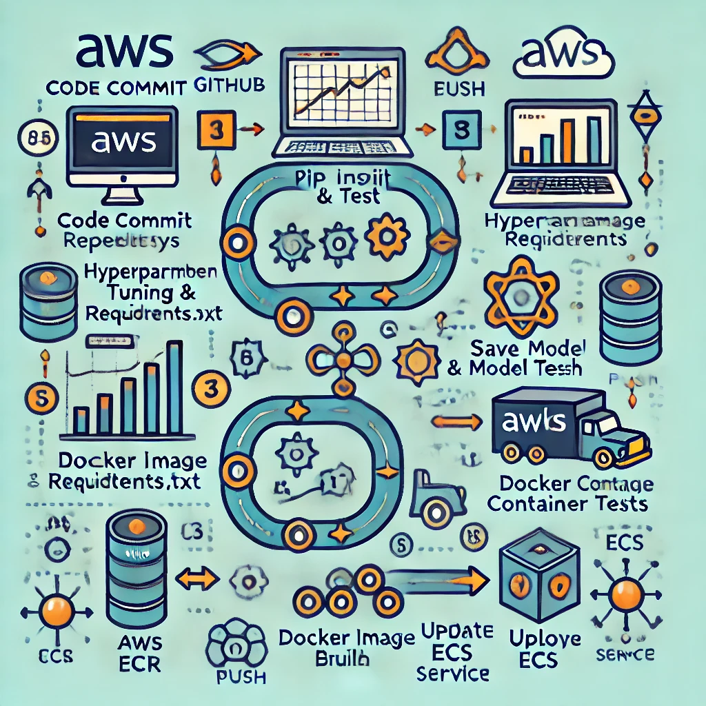

# Stock Price Prediction AWS CI/CD Pipeline with Jenkins

## File Structure
```
├── Jenkinsfile
├── Dockerfile
├── pom.xml
├── stock_prediction.py
├── requirements.txt
├── tests
│   ├── unit_tests
│   │   ├── test_stock_prediction.py
├── README.md
```

## Overview
This repository sets up an AWS CI/CD pipeline using Jenkins for stock price prediction.

## Features
- Stock price prediction using RandomForestRegressor
- AWS ECR integration for Docker image management
- Automated unit testing using pytest
- Deployment to AWS ECS

## Setup Instructions
1. **Clone the repository:**
   ```sh
   git clone https://github.com/Rashadha/stock-prediction.git
   ```
2. **Set up credentials in Jenkins:**
   - Add AWS_ACCESS_KEY_ID and AWS_SECRET_ACCESS_KEY as Jenkins credentials.
3. **Configure AWS ECR:**
   ```sh
   aws ecr create-repository --repository-name stock-prediction-ecr
   ```
4. **Run the pipeline in Jenkins:**
   - Select the environment when triggering the build.

Here’s a pipeline diagram illustrating the AWS CI/CD process with Jenkins for your stock price prediction project:  

### **Pipeline Stages**  
1️. **Code Commit** (GitHub) →  
2️. **Jenkins Build & Test**  
   - Install dependencies (`pip install -r requirements.txt`)  
   - Run unit tests (`pytest tests/unit_tests/`)  
3️. **Hyperparameter Tuning & Model Training**  
   - Train model with GridSearchCV  
   - Save best model (`joblib.dump`)  
4️. **Docker Image Build & Push** (AWS ECR)  
5️. **Deploy to AWS ECS**  
   - Update ECS Service  



